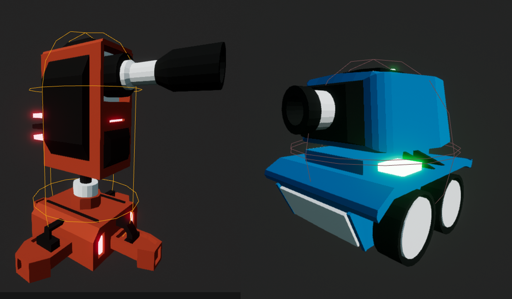

[![Contributors][contributors-shield]][contributors-url]
[![MIT License][license-shield]][license-url]
[![LinkedIn][linkedin-shield]][linkedin-url]

[![Status][badge]](https://github.com/RodrigoQuiroz09/ToonTanks) [![Udemy][udemy-shield]][udemy-url]

<!-- PROJECT LOGO -->
 

  

<h2 align="center">Toon Tanks</h2>

<!-- TABLE OF CONTENTS -->

  
Table of Contents

  <ol>
    <li>
      <a href="#about-the-project">About The Project</a>
      <ul>
        <li><a href="#built-with">Built With</a></li>
        <li><a href="#external-tools">External Tools</a></li>
      </ul>
    </li>
    <li>
      <a href="#requirements">Requirements</a>
    </li>
    <li><a href="#acknowledgments">Acknowledgments</a></li>
  </ol>

<!-- ABOUT THE PROJECT -->

## About The Project

- Personal project only to show on portfolio made within the udemy course "Unreal Engine 5 C++ Developer: Learn C++ & Make Video Games" made by GameDev.tv
- You control a blue tank that can move around a world, can aim and shoot. In addition there are enemies that can destroy the player and you have to take them down.

(<a href="#top">back to top</a>)

### Built With

- [![Unreal][unreal.com]][unreal-url]
- [![C++][cplus.com]][cplus-url]
- [![Epic Games][epic.com]][epic-url]

### External tools

- [![VSCode][vsc.com]][vsc-url]
  - <strong>Core Extensions</strong>
  - C/C++ by Microsoft
  - C/C++ Extension Pack by Microsoft
  
(<a href="#top">back to top</a>)

<!-- GETTING STARTED -->

## Requirements

- Unreal Engine Version 5.01
- C/C++ Programming Language
- Visual Studio 2022 with a Compiler Version 14.31.31103

(<a href="#top">back to top</a>)

<!-- ACKNOWLEDGMENTS -->

## Acknowledgments and Assets

- [Unreal Engine 5 C++ Developer: Learn C++ & Make Video Games](https://www.udemy.com/course/unrealcourse/)

<!-- MARKDOWN LINKS & IMAGES -->
<!-- https://www.markdownguide.org/basic-syntax/#reference-style-links -->

[contributors-shield]: https://img.shields.io/github/contributors/RodrigoQuiroz09/ToonTanks.svg?style=for-the-badge
[contributors-url]: https://github.com/RodrigoQuiroz09/ToonTanks/graphs/contributors
[license-shield]: https://img.shields.io/github/license/RodrigoQuiroz09/ToonTanks.svg?style=for-the-badge
[license-url]: https://github.com/RodrigoQuiroz09/ToonTanks/blob/master/LICENSE.txt
[linkedin-shield]: https://img.shields.io/badge/-LinkedIn-black.svg?style=for-the-badge&logo=linkedin&colorB=555
[linkedin-url]: https://linkedin.com/in/rodrigo-q-3b8213129/
[badge-dev]: https://forthebadge.com/images/badges/built-by-developers.svg
[badge-dev-url]: http://ForTheBadge.com/images/badges/built-by-developers.svg
[product-screenshot]: images/mainmenu.PNG
[udemy-shield]: https://img.shields.io/badge//Made%20with-Udemy-EC5252?style=for-the-badge&logo=Udemy&logoColor=white
[udemy-url]: https://www.udemy.com
[unreal-url]: https://www.unrealengine.com/en-US
[unreal.com]: https://img.shields.io/badge/unrealengine-%23313131.svg?style=for-the-badge&logo=unrealengine&logoColor=white
[cplus-url]: https://cplusplus.com
[cplus.com]: https://img.shields.io/badge/c++-%2300599C.svg?style=for-the-badge&logo=c%2B%2B&logoColor=white
[vsc-url]: https://code.visualstudio.com
[vsc.com]: https://img.shields.io/badge/Visual_Studio_Code-0078D4?style=for-the-badge&logo=visual%20studio%20code&logoColor=white
[epic-url]: https://www.epicgames.com/site/en-US/home
[epic.com]: https://img.shields.io/badge/epicgames-%23313131.svg?style=for-the-badge&logo=epicgames&logoColor=white
[badge]: https://img.shields.io/badge/Status-Done-green?style=for-the-badge
